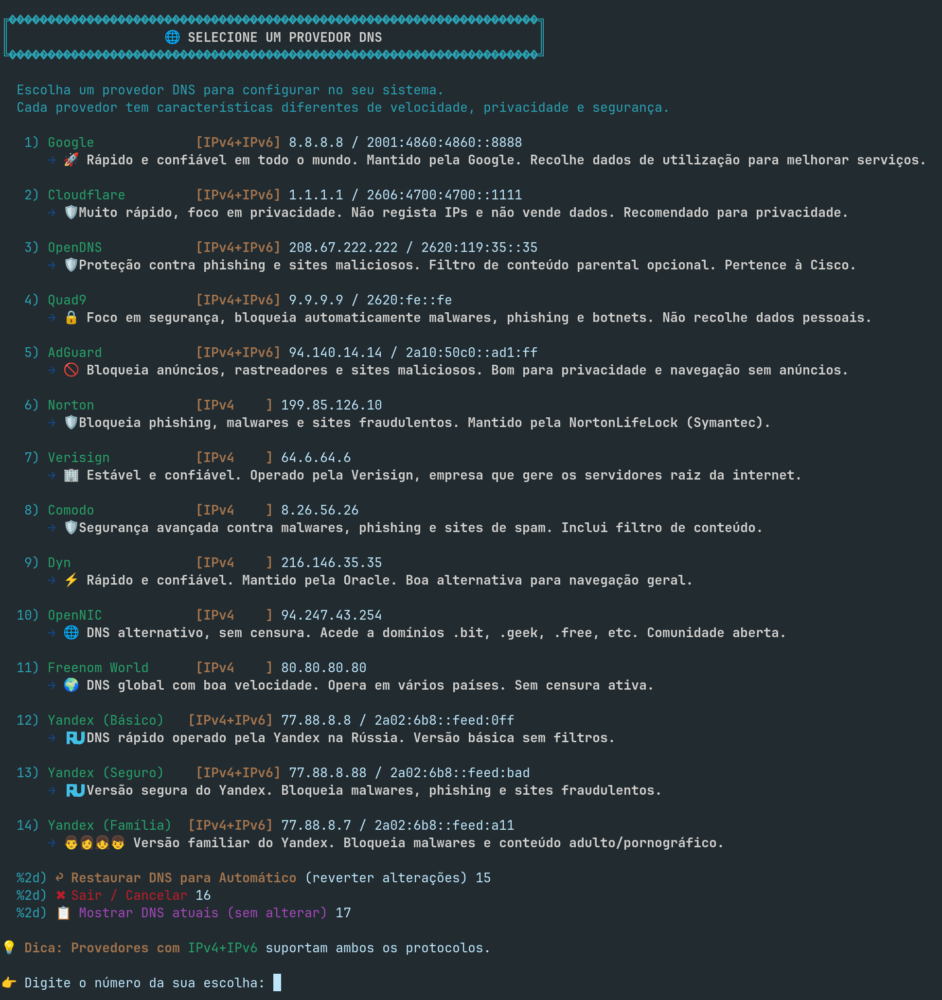
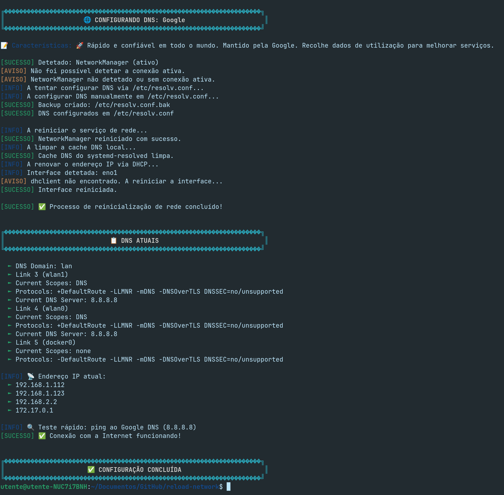

# 🔄 reload-network

**Script Bash para reiniciar definições de rede com menu interativo para escolher provedores DNS**

---

## 📖 Sobre

**reload-network** é um script Bash que permite reiniciar as definições de rede no Linux de forma simples e interativa. Com um menu colorido e intuitivo, pode escolher entre vários provedores DNS gratuitos para configurar automaticamente no seu sistema.

Ideal para:
- ✅ Contornar bloqueios de sites por DNS
- ✅ Melhorar a velocidade de navegação
- ✅ Aumentar a privacidade e segurança online
- ✅ Resolver problemas de conectividade

---

## 🚀 Características

- 🎨 Menu interativo com cores
- 🌐 14 provedores DNS: Google, Cloudflare, OpenDNS, Quad9, AdGuard, Norton, etc.
- 📝 Descrição detalhada de cada provedor
- 🔄 Suporte IPv4 e IPv6
- 🖥️ Compatível com NetworkManager
- 🔧 Modo fallback via /etc/resolv.conf
- 🧹 Limpeza de cache DNS
- 🔄 Renovação DHCP
- 📊 Teste de conectividade

---

## 🌐 Provedores DNS Suportados

| # | Provedor | IPv4 | Característica |
|:-:|:---------|:-----|:---------------|
| 1 | Google | 8.8.8.8 | 🚀 Rápido e global |
| 2 | Cloudflare | 1.1.1.1 | 🛡️ Privacidade |
| 3 | OpenDNS | 208.67.222.222 | 🛡️ Anti-phishing |
| 4 | Quad9 | 9.9.9.9 | 🔒 Segurança |
| 5 | AdGuard | 94.140.14.14 | 🚫 Bloqueia anúncios |
| 6 | Norton | 199.85.126.10 | 🛡️ Anti-malware |
| 7 | Verisign | 64.6.64.6 | 🏢 Estável |
| 8 | Comodo | 8.26.56.26 | 🛡️ Segurança |
| 9 | Dyn | 216.146.35.35 | ⚡ Rápido |

---

## 📸 Screenshots

### Menu Principal

### Exemplo de Configuração

## 🔧 Instalação Rápida

### bash
curl -sSL https://raw.githubusercontent.com/activecop/reload-network/main/reload-network.sh -o ~/reload-network.sh
chmod +x ~/reload-network.sh
sudo mv ~/reload-network.sh /usr/local/bin/reload-network
